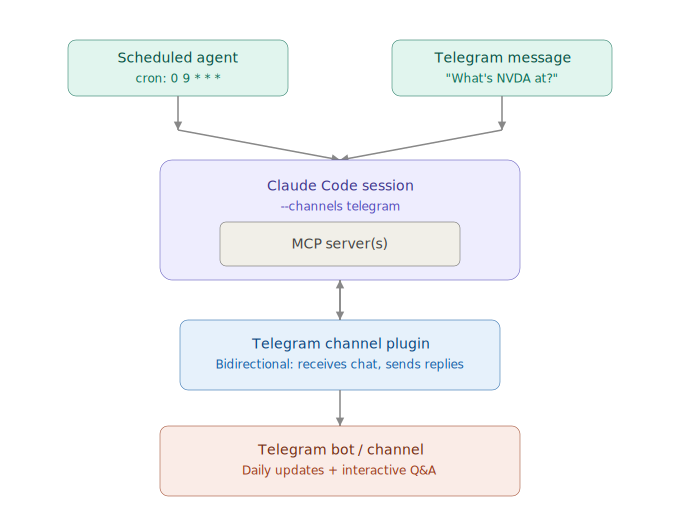

# claude-channel-task-scheduler

Containerized app for using an interactive Claude Code channel plugin (Telegram) with an MCP server and scheduled tasks.

## How It Works

The container runs an active Claude Code session with the Telegram channel plugin configured, and support for scheduled tasks and MCP server(s). All output from both scheduled tasks and interactive channel input then flows back out to Telegram.

## Usage

```
docker compose build --no-cache
docker compose up -d
docker compose exec cc-task-scheduler sh
```

### Scheduling Tasks in the Claude Code Session

```
/schedule create \
  --cron "0 16 * * 1-5" \
  --prompt "Send an end-of-day market recap for NVDA, SPY, AAPL to Telegram."
```

## Architecture


